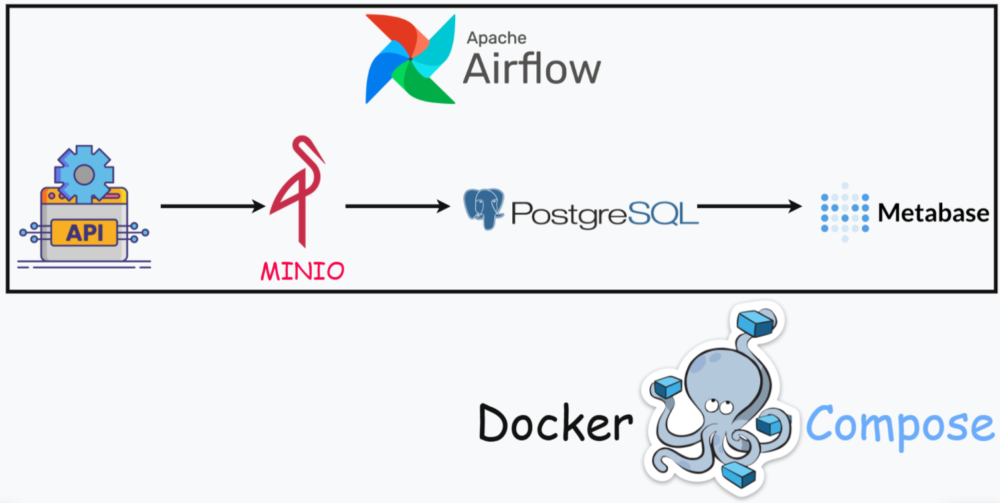

# Архитектура


# Описание
В качестве источника данных служит API, содержащее информацию о землетрясениях на Земле. Данные инкрементально поступают в MINIO (S3) в сыром виде, откуда последовательно извлекаются в DWH БД PostgreSQL (Primary Data Lake (PDL). Из PDL-слоя данные трансформируются и поступают в Core Layer-слой (CL) в качестве таблиц по схеме "Звезда". Откуда данные извлекаются в Data Mart-слой (DM), после чего при помощи MetaBase визуализируются.

# Гайд по запуску проекта у себя на компьютере локально
## 1. Создание форк репозитория
В правом верхнем углу нажми на кнопку "Fork", чтобы создать свою копию репозитория.
## 2. Клонирование репозитория на локальный компьютер
В терминале написать команды
```bash
git clone <URL-репозитория>
cd <каталог репозитория>
```
## 3. Установка виртуального окружения и зависимостей
В каталоге с проектом в терминале написать команды
```bash
python3.12 -m venv venv
source venv/bin/activate
pip install -r requirements.txt
```
## 4. Настройка файла .env
Создать файл в корне проекта с именем .env, указать логины, пароли для каждого инструмента (делается для сокрытия данных от посторонних лиц), пример прилагается, не забыть сохранить файл
```б
AIRFLOW_UID=50000

_POSTGRES_USER=postgres_dwh
_POSTGRES_PASSWORD=postgres_dwh
_POSTGRES_DB=postgres_dwh

POSTGRES_USER=airflow
POSTGRES_PASSWORD=airflow
POSTGRES_DB=airflow

MINIO_ROOT_USER=minioadmin
MINIO_ROOT_PASSWORD=minioadmin

_AIRFLOW_WWW_USER_USERNAME=airflow
_AIRFLOW_WWW_USER_PASSWORD=airflow
```
## 5. Разворачивание docker-compose
В каталоге с проектом в терминале написать команды
```bash
docker-compose built
docker-compose up -d
```
Адреса инструментов в браузере:
AirFlow - http://localhost:8080
MinIO - http://localhost:9001
MetaBase - http://localhost:3000
PostgreSQL - используйте DBeaver, PG Admin и т.д. для подключения и лучшей визуализации (Хост - localhost, БД - postgres_dwh, Порт - 5433, Пользователь - postgres_dwh, Пароль - postgres_dwh) - ПО ПРИМЕРУ С ДАННЫМИ ПОДКЛЮЧЕНИЯМИ ВЫШЕ, У ВАС МОГУТ БЫТЬ ДРУГИЕ, КОГДА ЗАДАДИТЕ!
## 6. Настройка коннекторов в AirFlow
Создадим ключ для подключения к MinIO, вкладка Access Keys (сбоку слева), жмём create, копируем ключи (их надо вставить в коннектор AirFlow, инфа ниже)
Для взаимодействия с MinIO и PostgreSQL необходимы хуки-подключения к данным инструментам.
Когда инфраструктура после docker-compose up поднята, переходим по адресу выше для AirFlow, находим вкладку Admin - Connections - жмём плюсик:
1. Для PostgreSQL задаём id -  "conn_pg", type - Postgres, host, database, login, password как выше, port - 5432, сохраняете.
2. Для MinIO id - "conn_s3", type - Amazon Web Services, key id - что сгенерировал MinIO, access key - что сгенерировал MinIO, extra - {"endpoint_url": "http://minio:9000"}, сохраняете
## 7. SQL-запросы для создания схем, таблиц
После подключения к БД в PostgreSQL, необходимо создать схемы и таблицы.
```sql
--- СОЗДАНИЕ СЛОЁВ В DWH

CREATE SCHEMA pdl;
CREATE SCHEMA cl;
CREATE SCHEMA dm;
```

```sql
--- PRIMARY DATA LAYER - СОЗДАНИЕ ТАБЛИЦЫ

CREATE TABLE pdl.raw_earthquakes(
	id VARCHAR(50) NOT NULL PRIMARY KEY,
	time TIMESTAMP NOT NULL,
	latitude FLOAT NOT NULL,
	longitude FLOAT NOT NULL,
	depth FLOAT NOT NULL,
	mag FLOAT NOT NULL,
	mag_type VARCHAR(10) NOT NULL,
	nst FLOAT NULL,
	gap FLOAT NULL,
	dmin FLOAT NULL,
	rms FLOAT NULL,
	net VARCHAR(10) NOT NULL,
	updated TIMESTAMP NOT NULL,
	place VARCHAR(100) NOT NULL,
	type VARCHAR(50) NOT NULL,
	horizontal_error FLOAT NULL,
	depth_error FLOAT NULL,
	mag_error FLOAT NULL,
	mag_nst FLOAT NULL,
	status VARCHAR(40) NOT NULL,
	location_source VARCHAR(10) NOT NULL,
	mag_source VARCHAR(10) NOT NULL
);
```

```sql
--- CORE LAYER - СОЗДАНИЕ ТАБЛИЦ

CREATE TABLE cl.dim_time(
	id SERIAL PRIMARY KEY,
	time TIMESTAMP NOT NULL,
	year INT NOT NULL,
	month INT NOT NULL,
	hour INT NOT NULL,
	minute INT NOT NULL,
	second INT NOT NULL,
	microsecond INT NOT NULL,
	day_of_week VARCHAR(10) NOT NULL
);

CREATE TABLE cl.dim_location(
	id SERIAL PRIMARY KEY,
	latitude FLOAT NOT NULL,
	longitude FLOAT NOT NULL,
	place VARCHAR(100) NOT NULL,
	region VARCHAR(50) NOT NULL,
	country VARCHAR(50) NOT NULL
);

CREATE TABLE cl.dim_magnitude(
	id SERIAL PRIMARY KEY,
	mag FLOAT NOT NULL,
	mag_type VARCHAR(10) NOT NULL,
	mag_error FLOAT NULL,
	mag_source VARCHAR(10) NULL
);

CREATE TABLE cl.fact_earthquakes(
	id VARCHAR(50) NOT NULL PRIMARY KEY,
	depth FLOAT NOT NULL,
	nst FLOAT NULL,
	gap FLOAT NULL,
	dmin FLOAT NULL,
	rms FLOAT NULL,
	status VARCHAR(40) NOT NULL,
	time_id INT NOT NULL,
	location_id INT NOT NULL,
	magnitude_id INT NOT NULL
);
```

```sql
--- DATA MART - СОЗДАНИЕ ТАБЛИЦ

--- Для расчета общего числа землетрясений на Земле за определенную дату
CREATE TABLE dm.all_count (
	date VARCHAR(10) NOT NULL,
	earthquakes_count INT NOT NULL
);

--- Для расчета количества землетрясений за определенную дату в стране
CREATE TABLE dm.country_count (
	date VARCHAR(10) NOT NULL,
	country VARCHAR(50) NOT NULL,
	earthquakes_count INT NOT NULL
);

--- Для расчета максимального количества землетрясений в определенную дату в регионе
CREATE TABLE dm.region_count (
	date VARCHAR(10) NOT NULL,
	region VARCHAR(50) NOT NULL,
	earthquakes_count INT NOT NULL
);
```
## 8. DAG
Все даги идемпотенты, имеются сенсоры. Отрабатывают они ежедневно (@daily в настройке dag), чтобы менять дату(ы) находите параметр start_date в DEFAULT_ARGS и задавайте свою. Дата date_to задана по макросу на один день больше, чем date_from в PythonOperator в op_kwargs, меняйте и настраивайте периоды дат так, как хочется вам.
## 9. Заключение
Когда надоело, то пишем в терминале
```bash
docker-compose stop
```
Захочется запустить снова
```bash
docker-compose up -d
```